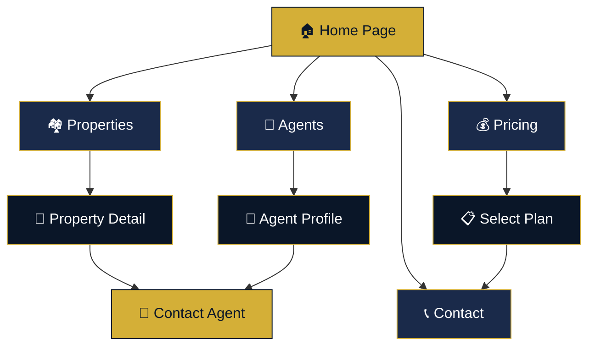
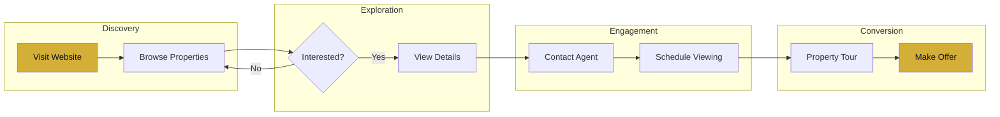
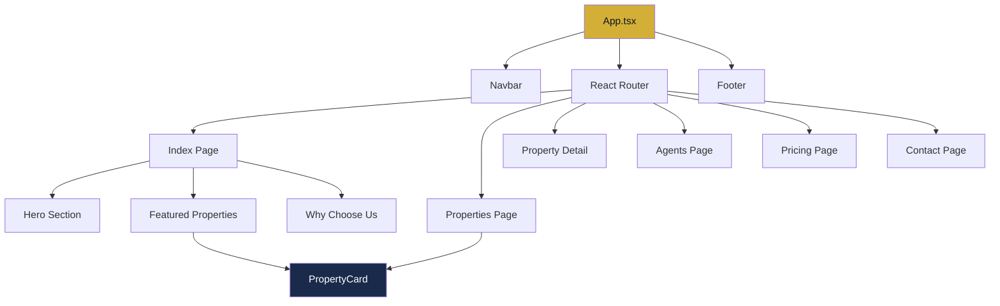

<p align="center">
  
</p>

<h1 align="center">🏠 LuxeHomes Real Estate Platform</h1>

<p align="center">
  
  
  
  
  
</p>

<p align="center">
  A modern, luxury real estate platform designed to showcase premium properties with an elegant navy and gold aesthetic.
</p>

---

## 📋 Table of Contents

| Section | Description |
|---------|-------------|
| [Overview](#-overview) | Project introduction and goals |
| [Tech Stack](#-tech-stack) | Technologies and frameworks used |
| [Features](#-features) | Key features and functionalities |
| [Site Architecture](#-site-architecture) | Flowchart of website structure |
| [User Journey](#-user-journey) | How users navigate the platform |
| [Pages](#-pages) | Detailed page descriptions |
| [Color Palette](#-color-palette) | Design system colors |
| [Getting Started](#-getting-started) | Installation and setup |

---

## 🎯 Overview

**LuxeHomes** is a premium real estate website designed to connect luxury property seekers with their dream homes. The platform features:

- 🏡 **Property Listings** - Browse curated luxury properties
- 👥 **Expert Agents** - Connect with experienced real estate professionals
- 💰 **Transparent Pricing** - Clear service tier options
- 📞 **Easy Contact** - Streamlined inquiry process

---

## 🛠 Tech Stack

| Technology | Purpose | Version |
|------------|---------|---------|
|  | UI Framework | 18.3.1 |
|  | Type Safety | 5.0+ |
|  | Styling | 3.4+ |
|  | Build Tool | 5.0+ |
|  | Navigation | 6.30+ |
|  | Components | Latest |
|  | Icons | Latest |

---

## ✨ Features

```
┌─────────────────────────────────────────────────────────────────┐
│                    LUXEHOMES FEATURES                           │
├─────────────────────────────────────────────────────────────────┤
│  🏠 Property Browsing    │  Search and filter luxury listings  │
│  📸 Image Galleries      │  High-quality property photography  │
│  👤 Agent Profiles       │  Connect with expert professionals  │
│  💳 Pricing Plans        │  Flexible service tier options      │
│  📧 Contact Forms        │  Easy inquiry submission            │
│  📱 Responsive Design    │  Works on all devices               │
└─────────────────────────────────────────────────────────────────┘
```

---

## 🗺 Site Architecture



---

## 🚶 User Journey



---

## 📄 Pages

### Page Structure Overview

| Page | Route | Purpose | Key Components |
|------|-------|---------|----------------|
| 🏠 **Home** | `/` | Landing page with hero & featured properties | Hero, PropertyCards, WhyChooseUs |
| 🏘 **Properties** | `/properties` | Full property catalog with filters | SearchFilters, PropertyGrid |
| 🏡 **Property Detail** | `/property/:id` | Individual property information | Gallery, Details, ContactAgent |
| 👥 **Agents** | `/agents` | Team of real estate professionals | AgentCards, ContactButtons |
| 💰 **Pricing** | `/pricing` | Service tier comparison | PricingTable, PlanCards |
| 📞 **Contact** | `/contact` | Inquiry form and location | ContactForm, Map, Info |

### Detailed Page Descriptions

<details>
<summary><b>🏠 Home Page</b></summary>

| Section | Description |
|---------|-------------|
| **Navbar** | Logo + navigation links (Home, Properties, Agents, Pricing, Contact) |
| **Hero** | Large banner with headline and CTA button |
| **Featured Properties** | Grid of 6 property cards with images, titles, prices |
| **Why Choose Us** | 4 feature cards with icons highlighting benefits |
| **Footer** | Quick links, social icons, contact information |

</details>

<details>
<summary><b>🏘 Properties Page</b></summary>

| Section | Description |
|---------|-------------|
| **Search Filters** | Location, property type, price range, bedrooms |
| **Property Grid** | Responsive grid of all available properties |
| **Property Cards** | Image, title, price, location, "View Details" button |

</details>

<details>
<summary><b>🏡 Property Detail Page</b></summary>

| Section | Description |
|---------|-------------|
| **Banner Image** | Large hero image of the property |
| **Property Info** | Title, price, location, key features |
| **Description** | Detailed property description |
| **Image Gallery** | 4 additional property images |
| **Contact Agent** | Button to reach the listing agent |

</details>

---

## 🎨 Color Palette

| Color | Hex | HSL | Usage |
|-------|-----|-----|-------|
|  Navy | `#0A1628` | `220 60% 10%` | Primary background |
|  Navy Light | `#1a2a4a` | `220 50% 20%` | Secondary background |
|  Gold | `#D4AF37` | `45 65% 52%` | Primary accent |
|  Gold Light | `#E8D5A3` | `45 55% 77%` | Secondary accent |
|  White | `#FFFFFF` | `0 0% 100%` | Text on dark |

---

## 🚀 Getting Started

### Prerequisites

```bash
# Required
Node.js >= 18.0.0
npm >= 9.0.0
```

### Installation

```bash
# 1. Clone the repository
git clone <YOUR_GIT_URL>

# 2. Navigate to project directory
cd <YOUR_PROJECT_NAME>

# 3. Install dependencies
npm install

# 4. Start development server
npm run dev
```

### Build for Production

```bash
# Create production build
npm run build

# Preview production build
npm run preview
```

---

## 📁 Project Structure

```
src/
├── assets/              # Images and static assets
│   ├── hero-banner.jpg
│   ├── property-*.jpg
│   └── agent-*.jpg
├── components/          # Reusable components
│   ├── ui/              # Shadcn UI components
│   ├── Navbar.tsx
│   ├── Footer.tsx
│   └── PropertyCard.tsx
├── pages/               # Page components
│   ├── Index.tsx        # Home page
│   ├── Properties.tsx
│   ├── PropertyDetail.tsx
│   ├── Agents.tsx
│   ├── Pricing.tsx
│   └── Contact.tsx
├── hooks/               # Custom React hooks
├── lib/                 # Utility functions
├── App.tsx              # Main app component
├── main.tsx             # Entry point
└── index.css            # Global styles & design tokens
```

---

## 📊 Component Hierarchy



---

## 📱 Responsive Breakpoints

| Breakpoint | Width | Layout |
|------------|-------|--------|
| 📱 Mobile | `< 640px` | Single column |
| 📱 Tablet SM | `640px+` | 2 columns |
| 💻 Tablet | `768px+` | 2-3 columns |
| 🖥 Desktop | `1024px+` | 3-4 columns |
| 🖥 Large | `1280px+` | Full layout |

---

## 📄 License

This project is licensed under the MIT License.

---

<p align="center">
  
</p>
